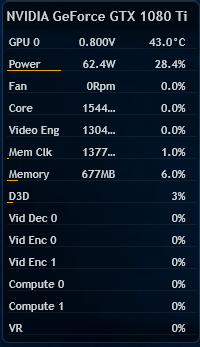

This Rainmeter skin allows you to quickly view CPU utilization, temperature, frequency and voltage.

# Screenshot

# Minimum Requirements
* Rainmeter 4.3
* Rainmeter HWiNFO 3.2 Plugin (https://www.hwinfo.com/forum/Thread-Rainmeter-plug-in-for-HWiNFO-3-2)
* HWiNFO 6.04-3720
* Nvidia GPUs

# Tested on
* Windows 10 (1809) with MSI 1080Ti Gaming X

